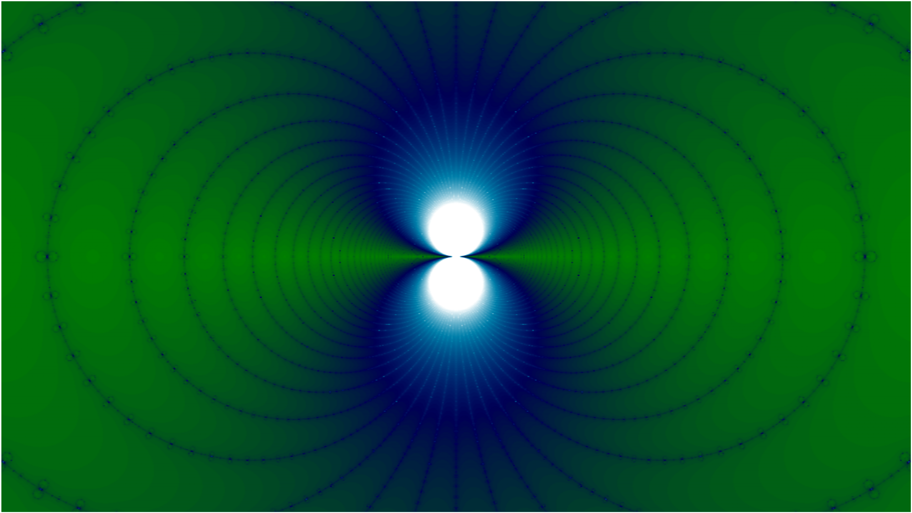
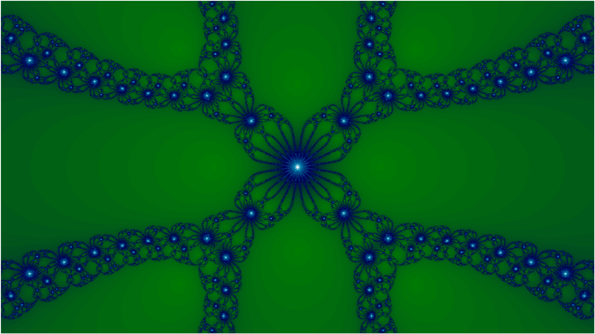
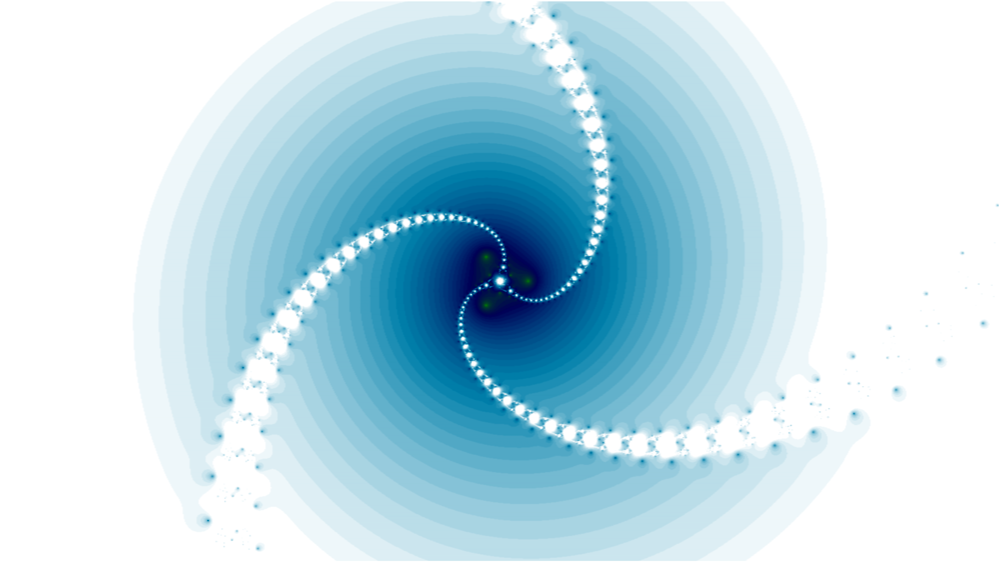
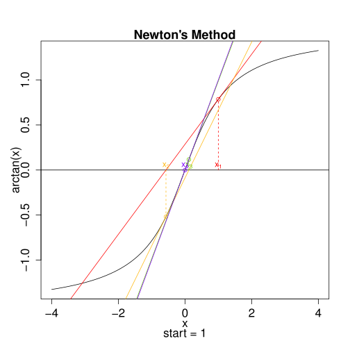
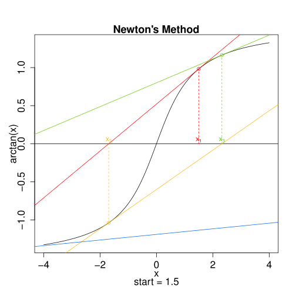
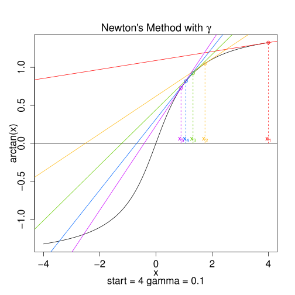

# numerical-veliz

Example code from the YouTube Channel for Oscar Veliz <https://www.youtube.com/OscarVeliz>
Distributed under MIT License.
See the wiki at <https://github.com/osveliz/numerical-veliz/wiki> for more documentation.

## Newton Fractals generated in gnuplot using NewtonFractal.plt

## Newton's Method visualizations created using IntervalConverge.r

