# numerical-veliz

Example code from the Oscar Veliz YouTube channel <https://www.youtube.com/OscarVeliz>.
Distributed under MIT License.
Become a [GitHub Sponsor](https://github.com/sponsors/osveliz) to support this project!
See the [Wiki](https://github.com/osveliz/numerical-veliz/wiki) for more documentation.
For community guidelines visit the [Code of Conduct](/.github/CODE_OF_CONDUCT.md) and [Contributing](/.github/CONTRIBUTING.md) documents.
Bug Reports and Topic Requests can be made submitted in the [Issues](https://github.com/osveliz/numerical-veliz/issues) forum.

## Newton Fractals generated in gnuplot using [NewtonFractal.plt](https://github.com/osveliz/numerical-veliz/tree/master/src/rootfinding/NewtonFractal.plt)

## Halley Fractals generated in gnuplot using [HalleyFractal.plt](https://github.com/osveliz/numerical-veliz/tree/master/src/rootfinding/HalleyFractal.plt)
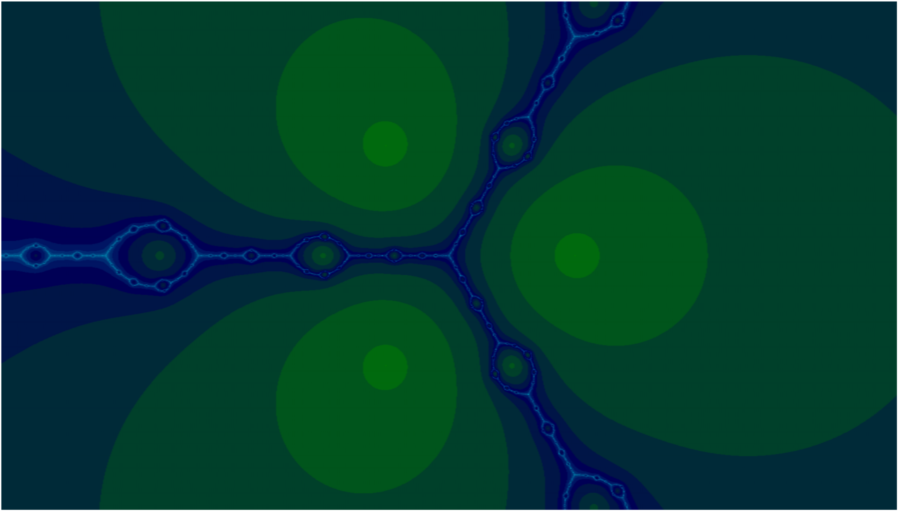
.png)
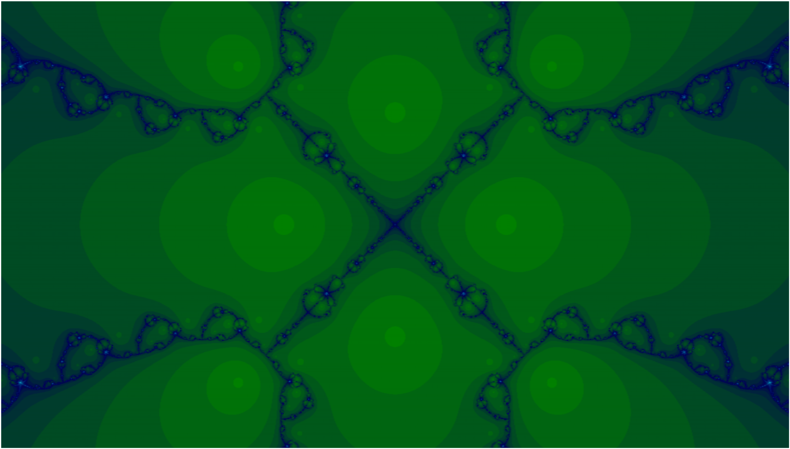
.png)

## Householder Fractals generated in gnuplot using [HouseholderFractal.plt](https://github.com/osveliz/numerical-veliz/tree/master/src/rootfinding/HouseholderFractal.plt)
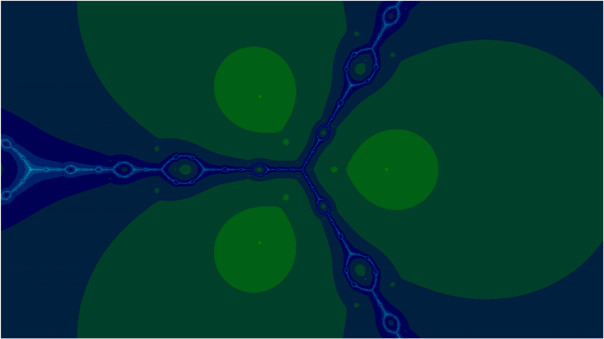
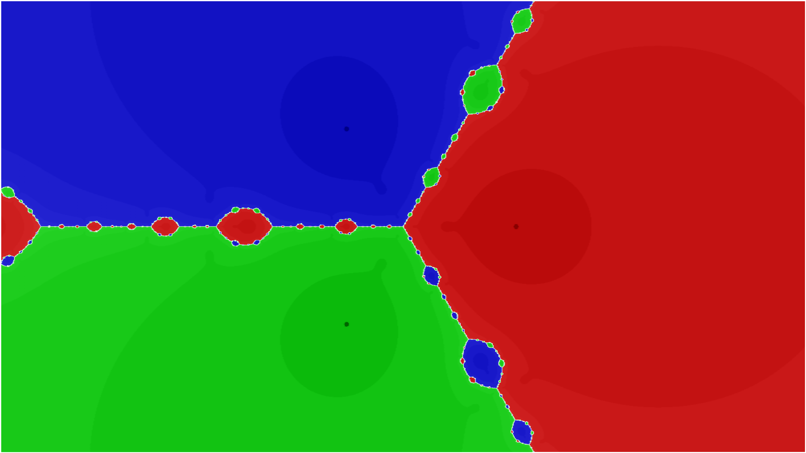
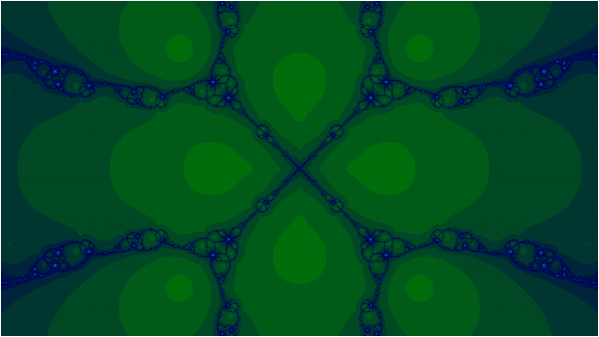
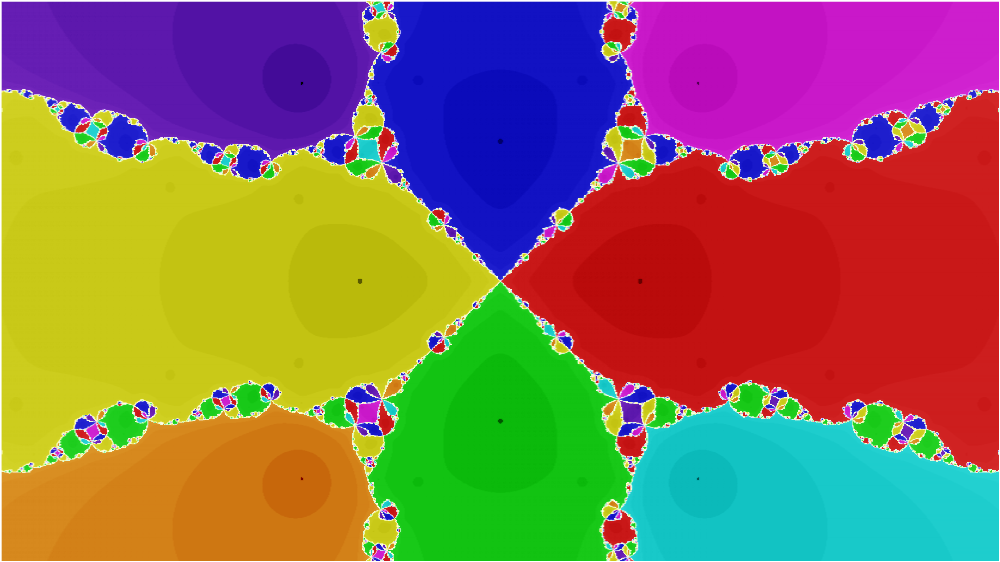
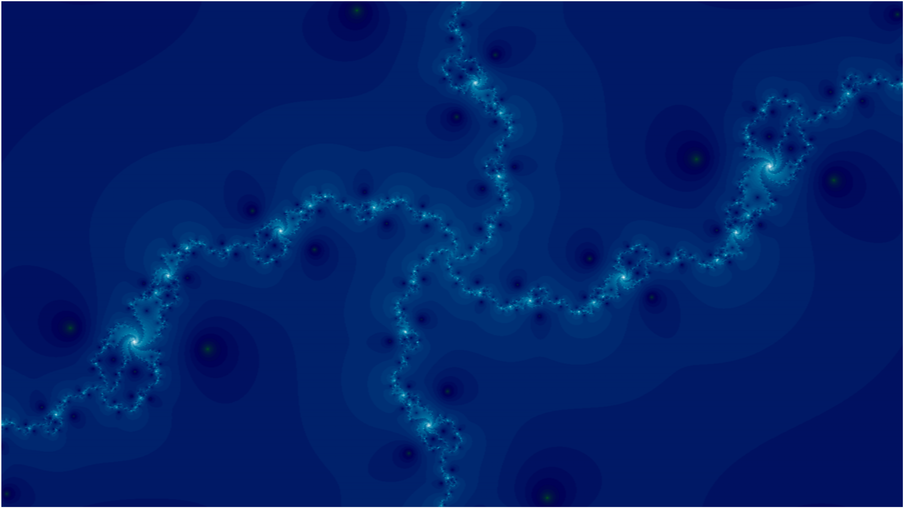

## Laguerre Fractals generated in gnuplot using [LaguerreFractal.plt](https://github.com/osveliz/numerical-veliz/tree/master/src/rootfinding/LaguerreFractal.plt)
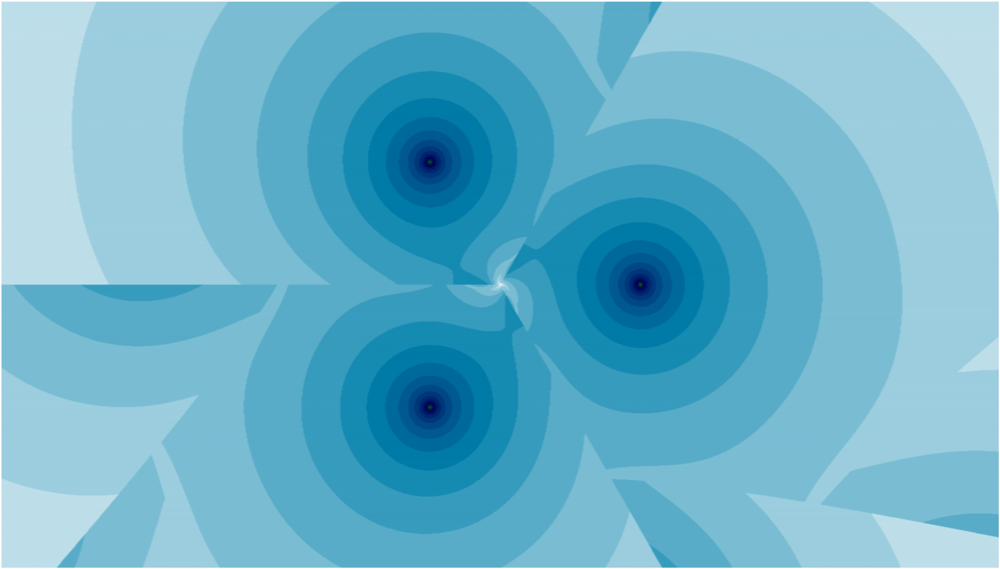
.png)
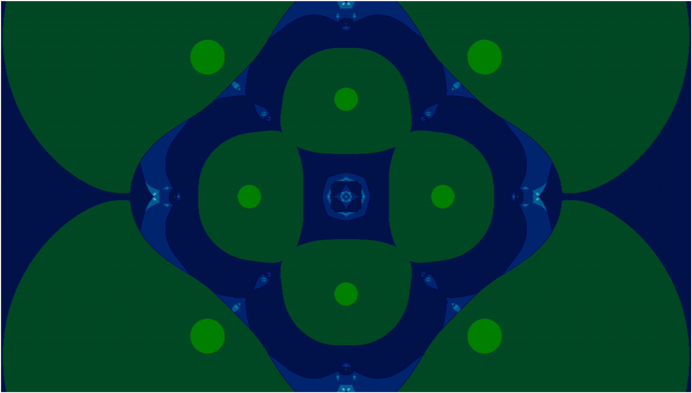
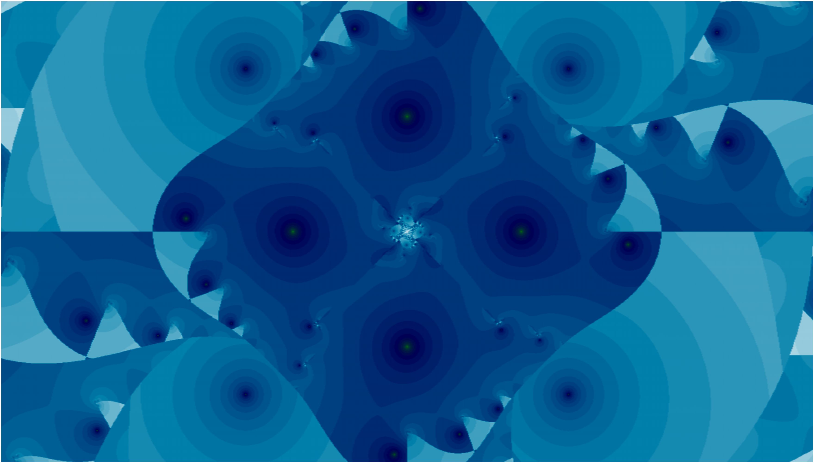
.png)
.png)

## Newton's Method visualizations created using [PlotNewtonHalley.r](https://github.com/osveliz/numerical-veliz/tree/master/src/rootfinding/PlotNewtonHalley.r)

## Halley's Method created using [PlotNewtonHalley.r](https://github.com/osveliz/numerical-veliz/tree/master/src/rootfinding/PlotNewtonHalley.r)

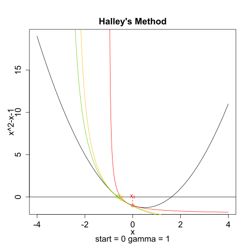
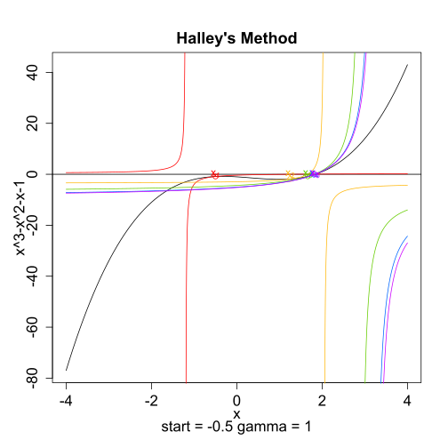

## Taylor Series created using [Taylor.m](https://github.com/osveliz/numerical-veliz/tree/master/src/series/Taylor.m)
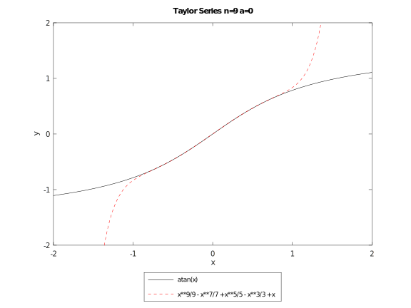
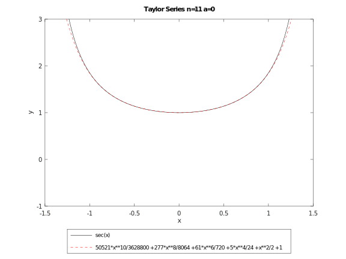
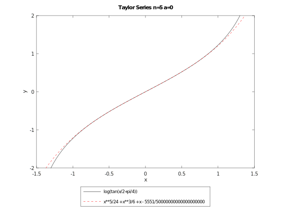

## Complex Plots created using [ComplexRoots.plt](https://github.com/osveliz/numerical-veliz/blob/master/src/rootfinding/ComplexRoots.plt)

