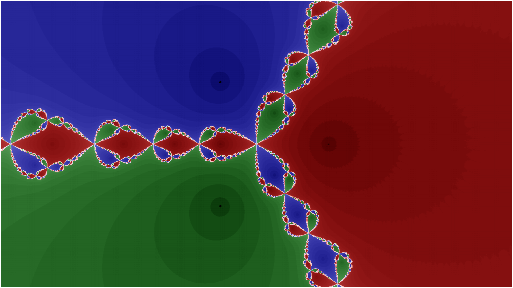

# numerical-veliz

Example code from the YouTube Channel for Oscar Veliz <https://www.youtube.com/OscarVeliz>
Distributed under MIT License.
See the wiki at <https://github.com/osveliz/numerical-veliz/wiki> for more documentation.

## Newton Fractals generated in gnuplot using [NewtonFractal.plt](https://github.com/osveliz/numerical-veliz/tree/master/src/rootfinding/NewtonFractal.plt)

## Newton's Method visualizations created using [IntervalConverge.r](https://github.com/osveliz/numerical-veliz/tree/master/src/rootfinding/IntervalConverge.r)

## Complex Plots created using [ComplexRoots.plt](https://github.com/osveliz/numerical-veliz/blob/master/src/rootfinding/ComplexRoots.plt)

